<picture>
  <source media="(prefers-color-scheme: dark)" srcset="assets/banner-dark.svg">
  <source media="(prefers-color-scheme: light)" srcset="assets/banner-light.svg">
  
</picture>

 
 

*I build software that runs in production — from enterprise ERP integrations to e-commerce platforms serving **15,000+ users**.*

 

## 🧭 About me

- 💼 **Full Stack .NET Developer** at **Esbi Bilişim** (Sakarya, Türkiye) — ERP-integrated commerce & enterprise products
- 🚀 Shipped production software on **four platforms**: web (ASP.NET Core), mobile (React Native / Expo), desktop (WinForms) and Windows services
- 🔌 Specialty: integrations connecting **Logo & Bay.t ERPs** to payment, marketplace and logistics platforms
- 🎓 M.Sc. **Data Science & AI** @ Sakarya University — OCR/NLP research on industrial monitoring (**TÜBİTAK 3501**)

## 📊 Highlights

<table>
  <tr>
    <td>👥&nbsp; <b>15,000+ members</b> served on the largest deployment</td>
    <td>💳&nbsp; <b>7 payment providers</b> behind one abstraction</td>
  </tr>
  <tr>
    <td>🛒&nbsp; <b>4 marketplaces</b> integrated — Trendyol, Hepsiburada, N11, Shopify</td>
    <td>🏭&nbsp; <b>10+ systems</b> running in production today</td>
  </tr>
  <tr>
    <td>📱&nbsp; <b>27-screen</b> field-sales mobile app, built end-to-end</td>
    <td>🔍&nbsp; <b>348-table ERP schema</b> reverse-engineered &amp; documented</td>
  </tr>
</table>

## 🛠️ What I build

- **Multi-tenant B2B/B2C e-commerce platform family** — a single .NET 8 core product scaled to four industry clients, automating the full order-to-invoice cycle against Logo &amp; Bay.t ERPs
- **Account reconciliation SaaS** — Clean Architecture, allow-listed relay security so ERP credentials never leave the company
- **Field sales automation** — React Native/Expo app + ASP.NET Core JWT API with GPS-stamped visits and server-side push notifications
- **AI-powered industrial monitoring** — hybrid OCR (TrOCR + Tesseract) and BERT-based NLP digitizing handwritten production forms

> 🔒 Most of my work lives in private company repositories — I'm happy to walk through the architecture and code in an interview.

## ⚙️ Tech stack

**Backend**

**Web & Mobile**

**Data & AI**

**DevOps & Tools**

## 📫 Contact

  ⚡ Portfolio website coming soon.

